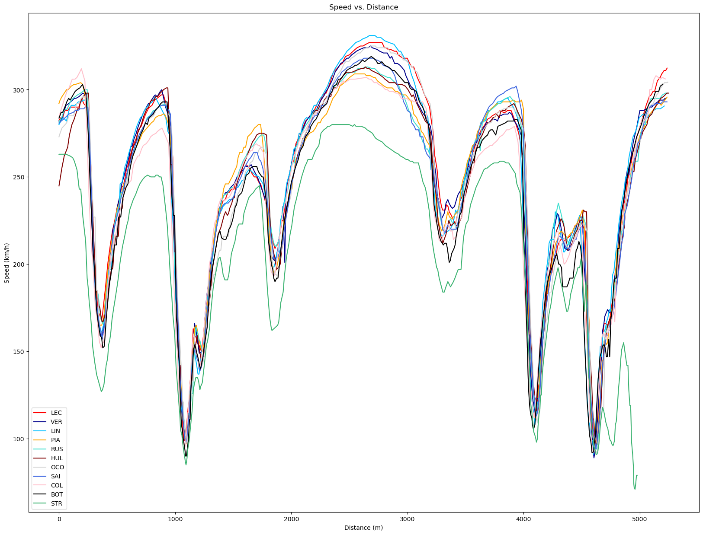

# FP1 Session Analysis – 2026 Australian Grand Prix

## Session Overview
Charles Leclerc (Ferrari) topped the session with a 1:20.267. The top 5 drivers were separated by 1.046 seconds and the total field was separated by 30.067 seconds. 
However, the last place driver, Lance Stroll (Aston Martin), had an unrepresentative session since he only completed three laps.
Removing Stroll leaves the field spread at 4.353 seconds.

## Team Fastest Lap Comparison

Lance Stroll is consistently slow and enters pit lane at the end of the lap.
Charles Leclerc is one of the fastest in the corners, but middle of the pack on straights, but that balanced out to be fastest overall.
Franco Colapinto (Alpine) and Valtteri Bottas (Cadillac) are consistently the next slowest on straights after Stroll.
Different teams are faster on different straights, likely dependent on when they deployed their batteries.
